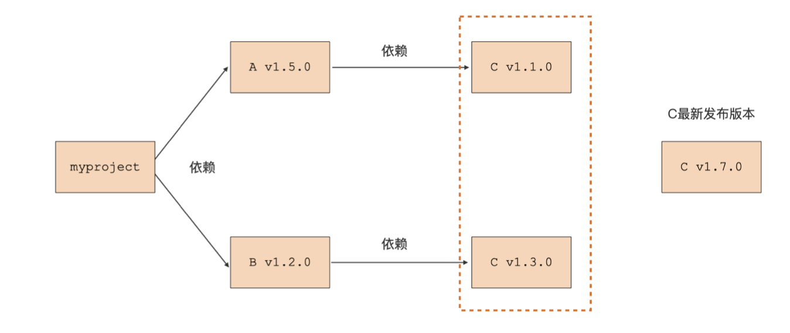

# Go Module

## 包管理历程

### GOPATH

Go 编译器会在配置的 GOPATH 路径下搜寻第三方包

```go
// 假设有这么一段代码

package main

import "example.com/foo/bar"

func main() {}
```

构建的时候 Go 编译器会根据配置的 GOPATH 搜索依赖的 `bar` 包，找不到会报错：`cannot find package "example.com/foo/bar" ...`。

如果 GOPATH 这么配置：`export GOPATH=/usr/local/go/projects:$HOME/go`，那么 Go 编译器会在下面这两个路径下搜索依赖的包是否存在：

```bash
/usr/local/go/projects/src/example.com/foo/bar
$HOME/go/src/example.com/foo/bar
```

### go get

如果所需的依赖包本地没有，该怎么解决呢？

可以通过 `go get` 命令将对应的包下载到本地：

```bash
❯ go get example.com/foo/bar
```

go get 会把包下载到 GOPATH 配置的目录下，不过下载的包是当时时刻的最新主线版本。如果下载的依赖包发生了 breaking change 就会导致本地编译失败，无法保证可重现的构建。

### vendor

为了保证自己项目依赖的第三方版本可控，Go 引入了 Vendor 机制解决问题。

vendor 机制的本质就是在 go 项目的某个特定目录下将项目引用的所有依赖包缓存起来，这个指定目录的名字就是 vendor。

Go 编译器会优先使用 vendor 目录下缓存的第三方包，而不是 GOPATH 路径下的。

>   如果想开启 vendor 机制，Go 项目必须位于 GOPATH 环境变量配置的某个路径的 src 目录下面。如果不满足，Go 编译器还是不会理会 Go 项目下的 vendor 目录。

所以 vendor 机制有几个致命缺点：

-   Go 项目必须放在 GOPATH 环境变量配置的路径下
-   庞大的 vendor 目录需要和项目代码一起版本控制，无效信息太多，影响仓库大小，干扰代码评审等
-   需要手动管理 vendor 下的 Go 依赖包，包括项目依赖包的分析、版本记录、依赖包获取和存放...

### Go Module

-   一个 Go Module 就是一个 Go 包的集合
-   module 是有版本的
-   通常一个代码仓库对应一个 module
-   每个 module 的顶层目录下会放置一个 go.mod 文件，每个 go.mod 文件会定义一个唯一的 module，一一对应
-   module 根目录及其子目录下的所有 Go 包均归属于这个 module，这个 module 也称为 main module

## Go Module 基本使用

1.   `go mod init xxx` 创建 go.mod 文件，将当前项目变为一个 Go Module
2.   `go mod tidy` 自动更新当前 module 的依赖信息
3.   `go build` 执行新 module 的构建

### 最小版本选择原则



上图所示，myproject 同时依赖 A、B，A 和 B 有一个共同依赖包 C，这时候如果 C 的最新版本为 v1.7.0，那这时候 Module 包管理器会按照 `最小版本选择原则` 选择 v1.3.0。

### 常用命令

#### 直接安装

比如项目中需要依赖到 `github.com/google/uuid` 这个包，可以直接执行 `go get github.com/google/uuid` 下载到本地的 module 缓存里，然后会自动在 `go.mod` 文件里面加上这个包的新增依赖：

```diff
 require (
+	 github.com/google/uuid v1.3.0  // direct
 )
```

#### 自动分析

在代码中直接 `import "github.com/google/uuid"`，然后执行 `go mod tidy` 命令，会自动分析当前源码的依赖变化，修改 `go.mod` 文件并下载它们。

#### 版本降级

方法一：手动降级

和上面手动方法一样，直接执行：`go get github.com/google/uuid@v1.2.0`。


方法二：自动维护

也是和上面一样，通过修改 `go.mod` 文件，实现依赖包的自我管理：

```bash
❯ go mod edit -require=github.com/google/uuid@v1.2.0
❯ go mod tidy
```

#### module vendor

之前说过，vendor 机制是诞生于 GOPATH 构建模式的年代，但是在 Go Module 构建模式下，vendor 机制还是保留了下来，方便一些使用场景。

Go Module 模式下，我们也不用手动维护 vendor 的依赖包，可以通过以下命令自动管理：

```bash
❯ go mod vendor
```

该命令会自动在项目根目录下创建 vendor 目录，并包含有当前项目依赖的包文件，而且在 vendor/modules.txt 中记录了 vendor 下的 module 及版本。

如果后续想基于 vendor 构建，直接在 go build 命令后面加上 `-mod=vendr` 即可。

Go1.14 及以后版本，如果项目根目录下存在 vendor 目录，即使不指定 `-mod=vendor` 也会默认基于 vendor 构建，除非显式给 go build 指定 `-mod=mod` 才会走 Go Module 本地缓存构建。

