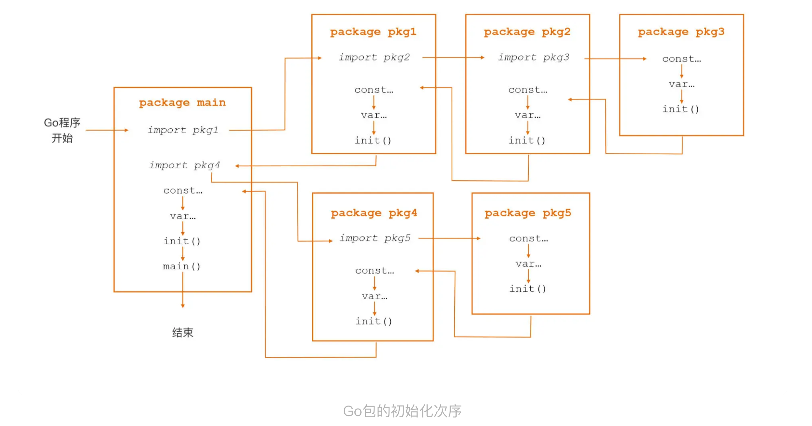

# Go程序的执行次序

## go 应用的入口函数

`main.main` 是所有 Go 可执行程序的用户层执行逻辑的入口函数。

main 函数没有参数也没有返回值。

而且 Go 语言要求：

-   **可执行程序的 main 包必须定义 main 函数，否则编译器会报错。**
-   启动了多个 Goroutine 的 Go 应用，main.main 函数将在 Go 程序的主 Goroutine 中执行。

-   main 函数返回意味着 Go 程序的终结，不管是否还有其他子 Goroutine 都会结束。

## go 包的初始化函数

Go 语言的特殊函数，用于进行包的初始化操作：**init 函数**：

```go
func init() {
    // 包初始化逻辑
}
```

init 函数的特点：

-   无参数无返回
-   不能手工显式调用
-   每个 Go 源文件都可以拥有多个 init 函数
-   同一个源文件中的多个 init 函数按照声明顺序依次执行

**下面这张图基本涵盖了所有场景下的 Go 程序初始化次序场景：**



简单来说，归纳为下面四点：

-   依赖包按照「深度优先」的次序进行初始化
-   包内按照「常量 -> 变量 -> init 函数」的顺序进行初始化
-   包内的多个 init 函数按出现次序进行调用
-   每个依赖包只会初始化一次

### init 函数的用途

1、因为 init 函数是在常量、变量初始化之后才执行的，所以我们可以在 init 函数中对包级变量进行检查和操作。

2、在 init 函数中实现”注册模式“

比如下面使用 lib/pq 包访问 PostgreSQL 数据库的代码示例：

```go
import (
	"database/sql"
    _ "github.com/lib/pq"
)

func main() {
    db, err := sql.Open("postgres", "user=pqpotest dbname=pqgotest")
    if err != nil {
        log.Fatal(err)
    }
    
    rows, err := db.Query("SELECT name FROM users WHERE age = 21")
    ...
}
```

这段代码没有使用 `pq` 包的任何东西，但是却能实现对 PostgreSQL 数据库的访问。

奥秘就在于这行：`_ "github.com/lib/pq"`。利用空导入，pq 包的 init 函数得以执行，而 pq 包的 init 函数如下：

```go
func init() {
    sql.Register("postgres", &Driver())
}
```

pq 包在 init 里面吧自己实现的 sql 驱动注册到了 sql 包中，这样只需要在应用层 Open 数据库的时候传入驱动的名字，就能得到具体某一类型数据库实例的操作句柄。

这种在 init 中注册自己的实现，本质是对工厂模式的实现，sql.Open 就是这个模式的工程方法，他根据外部传入的驱动名称生产处不同类别的数据库实例句柄。