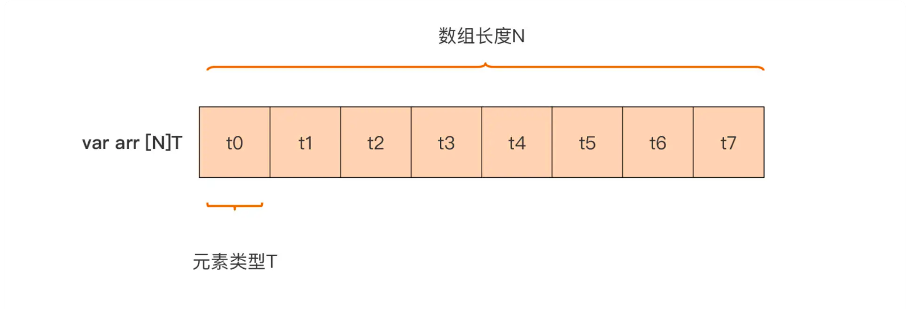
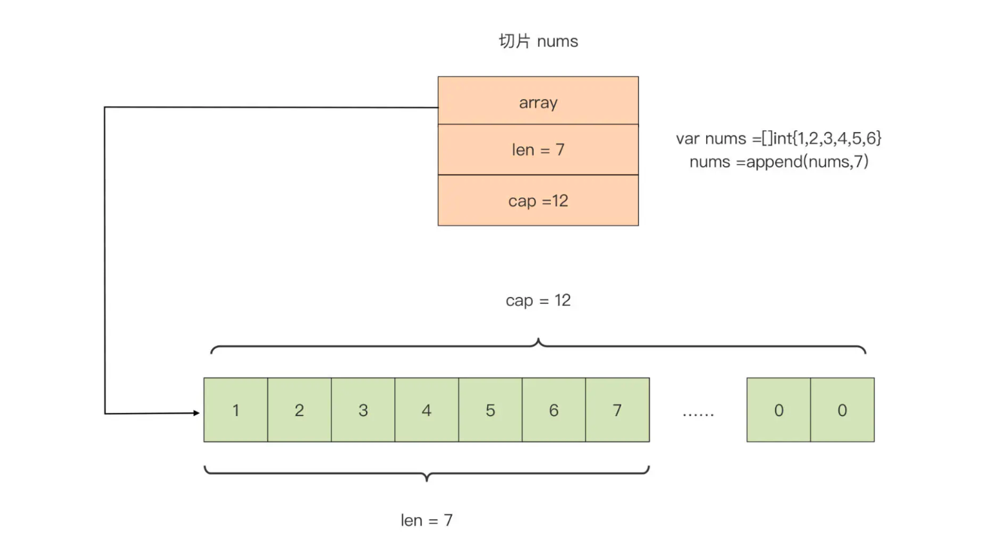
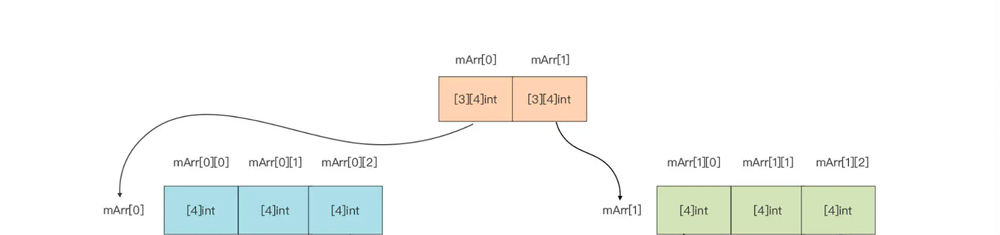

# 数组和切片

## 基本特性

### 数组

- 长度固定
- 组成元素的类型一样
- 连续

由于数组的元素一致，长度固定，所以 Go 中的数组变量声明如下：

```go
var arr [n]T
```

其中的元素类型为：`T`，数组的长度为`n`。数组的长度必须在声明的时候就给出，因为在编译阶段 Go 编译器就需要知道数组的长度好分配内存。

### 切片

- 组成元素的类型一样
- 连续

由于数组一旦定义好之后长度就固定了，使用起来难免不太方便，因此 Go 引入了切片的概念，Go 中的切片变量声明如下：

```go
var nums = []int{1, 2, 3, 4, 5, 6}
```

**注意：虽然在声明的时候不需要指定长度，但是切片还是有自己的长度属性的，只是这个长度会随着元素个数的变化而变化。**

## 内存表示

### 数组

数组不光在逻辑上有序，在实际分配内存的时候也是连续的，Go 编译器会直接申请一整块内存存放数组。



从某种意义上来说，数组在定义出来之后，其所占用的内存大小就是固定的了，如果两个数组占用的内存大小不一样，那这两个数组的类型也肯定不一样。

### 切片

切片在 Go 中是一个三元组结构，在运行时中表示如下：

```go
type slice struct {
    array unsafe.Pointer
    len int
    cap int
}
```

-   array：指向底层数组的指针
-   len：切片的长度，即切片中元素的动态个数
-   cap：底层数组的长度



从上可知，**声明切片的时候，Go 编译器会自动为新建的切片建立一个底层数组。**默认情况下，底层数组的长度和切片的初始元素个数一致，我们可以通过以下几个方法创建切片，并指定底层数组的长度：

**方法一：通过 make 函数创建切片**

```go
sl := make([]int, 6, 10)  // cap = 10, len = 6
```

也可以不指定 cap 参数，那么底层数组的长度 cap 就等于 len：

```go
sl := make([]int, 6)  // cap = len = 6
```

**方法二：通过已有的数组创建切片**

```go
arr := [10]int{1, 2, 3, ,4 ,5, 6, 7, 8, 9, 10}
sl := arr[3:7:9]  // low = 3, high = 7, max = 9 （前闭后开原则）
```

啥意思呢？

基于数组创建的切片，起始元素从 low 所标识的下标值开始，`len = high - low`，`cap = max - low`。

还记得上面说的切片结构吗，既然基于数组创建的切片，那么**这个切片的底层数组就是这个数组**，如果此时操作切片中的元素，数组中对应的元素也会跟着改变：

```go
sl[0] += 10
fmt.Println("arr[3] = ", arr[3])  // arr[3] = 14
```

在 Go 语言中，数组大多数“退居幕后”，层但底层存储空间的角色，切片就是数组的“描述符”。但正因这一特性，切片才能在函数参数传递时避免较大的性能开销：数组类型是值传递，切片则是引用传递。

通常，进行数组切片化的时候，省略 max，而 max 的默认值为数组的长度。

对于一个数组，可以基于此建立多个切片，这些切片共享这一同一底层数组，所以任一切片对其中某一元素的操作都会反映到其他切片中。

**但是：**如果不断忘切片里面添加元素，当元素的个数超过切片的 cap 时，此时切片会重新绑定一个更大容量的底层数组，这时候切片上任何元素的变更都和原数组没有任何关系。

**方法三：基于切片创建切片**

从一个切片中创建新的切片，其实就和上面从已有数组中创建切片一致，因为新老切片基于的数组都是同一个底层数组。

所有的特性都和上述一致。

## 常用操作

### 数组

假设有个数组：`var arr = [6]int{1, 2, 3, ,4 ,5, 6}`

1. 获取数组长度：`len(arr)  // 6 `
2. 获取数组内存大小：`unsafe.Sizeof(arr)  // 48`
3. 初始化
    1. 声明的时候，如果不指定元素的话，默认会把所有元素初始化成声明类型的零值
    2. 指定所有元素并带上长度：`var arr2 = [3]int{1, 2, 3}`
    3. 指定所有元素，不带上长度：`var arr3 = [...]int{1, 2, 3}`，此数组的长度就是 3
    4. 指定某个位置的元素：`var arr4 = [...]{99: 32}`，此数组长度为 100，`arr4[99]` 就是 39，其余均为 0
4. 通过下标取值，**但是不支持负数下标**
5. 多维数组定义：`var mArr [2][3]int`，这就是一个 2x3 的二维数组




### 切片

1. 获取切片长度：`len(nums)`
2. 动态添加元素：`nums = append(nums, 7)`

