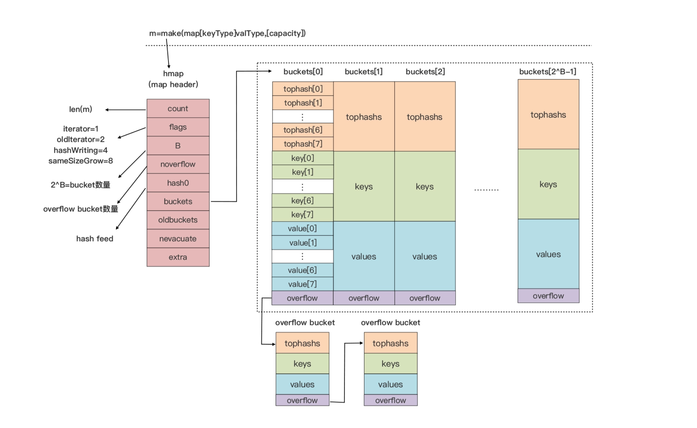
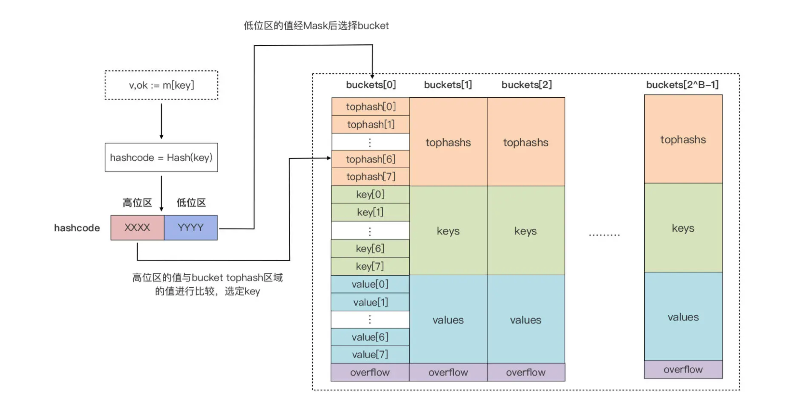
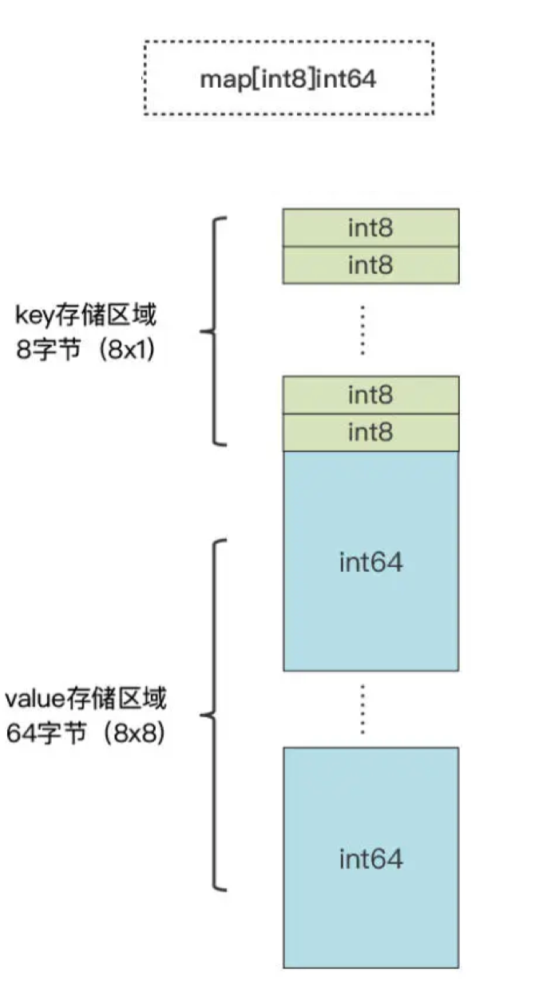
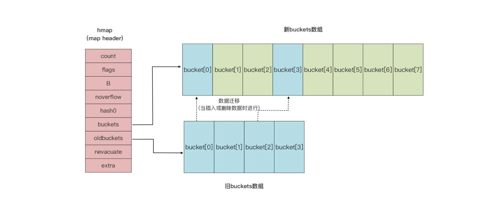

# map

## 基本特性

-   **无序**键值对
-   key 和 value 的类型没有相关性，可相同也可不同
-   key 的类型必须支持「==」和「!=」两种比较操作符，为了保证 key 的唯一性

## 内存表示

这是 map 类型在 Go 运行时层实现的示意图：



下面我们一层层剥开看。

### 初始状态

和语法层面 map 类型变量对应的是 *runtime.hmap 的实例，即 runtime.hmap 类型的指针。也就是说，map 类型数据在作为参数的传递过程中，算是「引用传递」。

hmap 类型是 map 类型的头部结构（header），它存储了后续 map 类型操作所需的所有信息：

| 属性       | 描述                                                         |
| ---------- | :----------------------------------------------------------- |
| count      | 当前 map 中的元素个数。对 map 类型变量运用 len 内置函数时，返回的 count 就是这个值 |
| flags      | 当前 map 所处的状态标志。目前定义了四个状态值：iterator、olditerator、hashWriting、sameSizeGrow |
| B          | B 的值是 bucket 数量的以 2 为底的对数，也就是 2^B = bucket 数量 |
| noverflow  | overflow bucket 的大约数量                                   |
| hashO      | 哈希函数的种子值                                             |
| buckets    | 指向 bucket 数组的指针                                       |
| oldbuckets | 在 map 扩容阶段，指向前一个 bucket 数组的指针                |
| nevacuate  | 在 map 扩容阶段充当扩容进度计数器，所有下标号小于 nevacuate 的 bucket 都已经完成了数据排空和迁移操作 |
| extra      | 可选字段。如果有 overflow bucket 存在，且 key、value 都因不包含指针而被内联（inline）的情况下，这个字段将存储所有指向 overflow bucket 的指针，保证 overflow bucket 是始终可用的（不被 GC 掉） |

### tophash 区

bucket 是真正用来存储键值对数据的，图中 bucket 分为三个区域：tophash区域、key存储区域、value存储区域。

每个 bucket 中默认存储的元素个数为 BUCKETSIZE（值为8，Go1.17 在$GOROOT/src/cmd/compile/internal/reflectdata/reflect.go 中定义，与 runtime/map.go 中常量 bucketCnt 保持一致）。

当我们往 map 中插入一条数据或者按 key 读取数据时，运行时都会使用哈希函数对 key 进行哈希运算，得到一个哈希值（hashcode）。运行时会把这个 hashcode 一分为二，分为高位区和低位区，低位区用来选定 bucket，高位区用来在选定的 bucket 中确定 key 的位置：



bucket 默认只能存 8 个元素，那当一个新 key 的 hashcode 低位区命中一个满元素的 bucket 时该怎么办？

如果此时的 map 尚未达到扩容条件，运行时会建立 overflow bucket，并将这个 overflow bucket 挂在这个 bucket 末尾的 overflow 指针上，这样两个 bucket 会形成一个链表结构，直到下次 map 扩容前，这个结构会一直存在。

### key 存储区

这是一块连续的内存区域，存储了 bucket 上的所有 key 数据。运行时分配 bucket 的时候就需要知道 key 的 size。

当我们声明一个 map 变量时，比如 `var m map[string]int`，Go 运行时就会为这个变量对应的 map 的类型生成一个 runtime.maptype 实例。如果这个实例已存在，会直接复用：

```go
type maptype struct {
    kyp			_type
    key			*_type
    elem		*_type
    bucket		*_type
    keysize		uint8  // key 的槽数
    elemsize	uint8  // value 的槽数
    bucketsize	uint8  // bucket 数
    flags		uint32
}
```

可以看到，这个实例包含了我们 map 类型中的所有“元信息”。

Go 运行时就是利用 maptype 参数中的信息确定 key 的类型和大小。map 所用的 hash 函数也存放在 maptype.key.alg.hash(key, hmap.hashO) 中。同时 maptype 的存在也让 Go 中所有 map 类型都共享一套运行时 map 操作函数，节省了对最终二进制文件空间的占用。

### value 存储区

这里也是一块连续的内存区域，存储 key 对应的 value。和上面 key 区一样，这个区的创还能也是得到 maptype 中信息的帮助。



### map 扩容

map 在什么情况下会进行扩容呢？Go 运行时的 map 实现引入了一个 LoadFactor（负载因子），当 `count > LoadFactor * 2^B` 或者 `overflow bucket` 过多时，运行时会自动对 map 进行扩容。


如果因为 `overflow bucket` 过多导致的扩容，实际上运行时会新建一个和现有规模一样的 bucket 数组，然后在 assign 和 delete 时做排空和迁移。

如果因为超过 LoadFactor 指定水位而进行扩容，那么运行时会建议一个**两倍于现有规模的 bucket 数组，**但真正的排空和迁移工作也是在 assign 和 delete 时逐步进行。

原 bucket 数组会挂在 hmap 的 oldbuckets 指针下面，直到原 buckets 数组中所有数据都迁移到新数组后，原 bucket 数组才会被释放。



### map 与并发

map 实例并发写是不安全的，也不支持并发读写。如果对 map 进行并发读写，运行时就会抛出异常。

对于写安全的需求可以采用 sync.Map 类型。


另外，考虑到 map 可以自动扩容，map 中数据元素的 value 位置可能在这一过程中发生变化，所以 Go 不允许获取 map 中 value 的地址，**这个约束是在编译期间就生效的。**

```go
p := &m[key]  // 这边会直接编译报错  Cannot take the address of m[key]
```


## 常用操作

### 声明

```go
var m map[string]int
```

和切片类型变量一样，如果没有显式的赋予初始值，map 类型的变量初始值为 nil。

>   初始值为 nil 的切片变量可以借助内置的 append 函数进行直接操作，这种成为「零值可用」

**但是 map 类型的变量因为内部实现的复杂性，无法「零值可用」。**直接对处于零值的 map 变量操作会导致运行时异常（panic），从而导致程序进程异常退出：

```go
var m map[string]int
m["key"] = 1  // 此处程序直接异常退出
```

### 初始化

**方法一：使用符合字面值初始化**

```go
m := map[int]string
```

这里直接显式地初始化了 map 变量，此时的 `m` 没有任何键值对，但是 `m` 也不等于初始值为 nil 的 map 变量，这时候直接进行键值对操作不会引起运行时异常。

再来看看一些比较复杂的符合字面值初始化：

```go
m1 := map[int][]string{
    1: []string{"val1", "val2"},
    3: []string{"val3", "val4"},
}

// key 为 struct 类型
type Position struct {
    x float64
    y float64
}
m2 := map[Position]string{
    Position(21.3, 34.3): "school",
    Position(345.2, 45.1): "shopping-mall",
}
```

上面 map 的 key 或者 value 都用到了比较复杂的复合类型元素，看起来比较乱。Go 对此提供了”语法糖“，因为 map 类型的声明中就已经包含了 key 和 value 的类型，编译器完全有足够的信息推导出各个值的类型，所以以上初始化代码可以这么写：

```go
m1 := map[int][]string{
    1: {"val1", "val2"},
    3: {"val3", "val4"},
}

m2 := map[Position]string{
    {21.3, 34.3}: "school",
    {345.2, 45.1}: "shopping-mall",
}
```


**方法二：使用 make 进行显式初始化**

和切片一样，通过 make 这种初始化方式，可以为 map 变量指定键值对的初始容量，但是无法进行具体的键值对赋值：

```go
m1 := make(map[int]string)  // 未指定初始容量
m2 := make(map[int]string, 8)  // 指定初始容量为 8
```

不过，map 和 切片一样，虽然声明了初始容量值，但是就像字面意思一样，这只是个初始容量，等后面键值对数量超过初始容量值之后，Go 运行时会自动增加 map 的容量，保证后续键值对的正常插入。

### 长度和容量

可以直接通过 `len` 获取当前键值对数，**但是不能对 map 类型调用 cap 获取当前容量。**

### 查找和数据读取

获取对应键的值很简单：

```go
m := make(map[string]int)
v := m["key1"]
```

这时候 `v` 获取到的是 0（value 元素类型的零值），有数据，但其实是不存在这个键的。


在 Go 语言中，map 类型支持用一种名为「command ok」的惯用法，进行对某个 key 的查询：

```go
m := make(map[string]int)
v, ok := m["key1"]
if !ok {
    // "key1" 不存在 map 中
}
```

### 删除数据

在 Go 里面，可以通过内置的 `delete` 函数删除 map 中的数据：

```go
m := map[string]int{
    "k1": 1,
    "k2": 2,
}

fmt.Println(m)  // map[k1:1 k2:2]
delete(m, "k2")  // 删除 "k2"
fmt.Println(m)  // map[k1:1]
```

>    注意：delete 函数是从 map 中删除键的唯一方法，即使要 delete 的键不存在，delete 函数也不会报错。

### 遍历数据

也是只用一种办法，和切片那样通过 for range 语法对 map 进行遍历：

```go
m := map[int]int{
    1: 11,
    2: 22,
    3: 33,
}

for k, v := range m {
    fmt.Printf("%d => %d\n", k, v)
}

/*
map 是无序的还记得吗 :)
1 => 11
3 => 33
2 => 22
*/
```

如果只想对 map 的 key 进行遍历，可以直接这么操作：

```go
for k := range m {
    fmt.Printf("key = %d", k)
}
```

