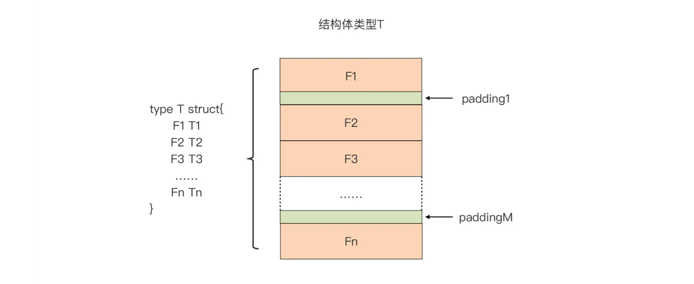
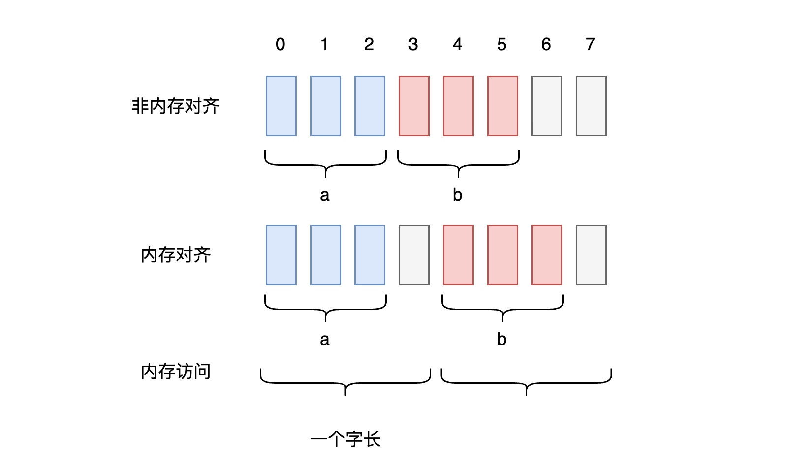
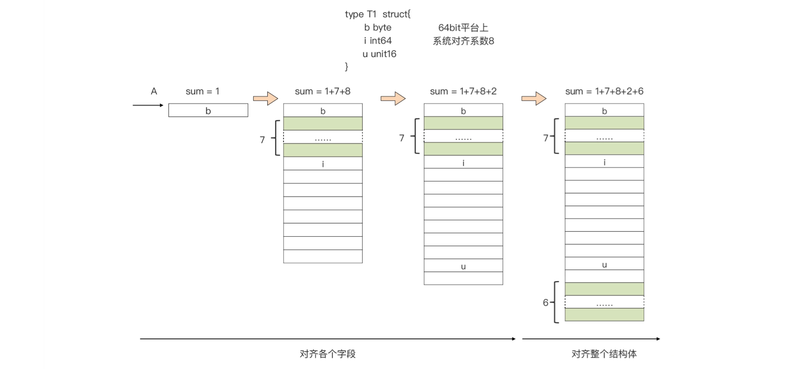

# 结构体

## 类型定义

在 Go 中，定义一个新类型有两种方法：

1.   类型定义，使用 `type` 关键字：`type NewType int` 定义一个 int 的新类型 `NewType`，int 是底层类型。
     1.   两个底层一样的类型变量，可以直接显式类型转换
2.   类型别名，`type NewType = int`，别名方式定义的新类型实际上就是 int，和上面不一样，上面是定义了一个新类型，而这边没有定义新类型。

## 定义结构体

定义结构体用到了上面提到的 `type` 关键字：

```go
type Book struct {
    Title string            // 书名
    Pages int               // 书的页数
    Indexes map[string]int  // 书的索引
}

// 声明 Book 类型变量
var b Book
// 字段赋值
b.Title = "The Go"
b.Pages = 800
```

### 使用方式

#### 空结构体

```go
type Empty struct{}

var s Empty
fmt.Println(unsafe.Sizeof(s))  // 0
```

空结构体类型的内存占用量为 0，所以可以将空结构体作为一个“事件”信息在 Goroutine 间通信：

```go
var c = make(chan Empty)
c <- Empty{}  // 向 channel 写入一个“事件“
```

#### 嵌入字段

结构体中的字段也可以是一个结构体类型，这种字段的字段名甚至可以省略：

```go
type Person struct {
    Name string
    Age int
}

type Book struct {
    Title string
    Person
}
```

`Book` 这个结构体里面，”嵌入“了一个 `Person` 结构体，那我们使用 `Person` 字段的时候该怎么弄呢？有两种方式：

1.   可以把类型名直接当做字段名使用
2.   也可以直接访问内嵌结构体里的字段

```go
var book Book

book.Person.Name = "Jack"
book.Age = 12

fmt.Println(book.Person.Name)
fmt.Println(book.Age)
```

>   注意：Go 不支持结构体里面内嵌自身类型的字段。
>
>   ```go
>   type T1 struct {
>       t2 T2
>   }
>   
>   type T2 struct {
>       t1 T1
>   }
>   ```
>
>   这种 T1、T2 的定义存在递归情况，也是不合法的。
>
>   
>
>   为什么呢？
>
>   一个类型所占内存大小在定义的时候就需要确定，但是如果嵌套自己，在计算占用大小时会死循环，而如果是指针、切片、map 等类型，其本质都是能确定内存占用的。

如果我们结构体内确实存在以自身类型定义的字段该怎么办？可以将自身类型以指针、以自身类型为元素、以自身类型为 value 的 map：

```go
type T struct {
    t *T
    st []T
    m map[string]T
}
```

#### 结构体初始化

##### 零值初始化

```go
var book Book  // book 就是零值结构体变量
```

零值初始化的 `Book` 显然是没有实际使用价值的，但如果一个零值初始化的类型能直接有使用价值，那这种类型成为”零值可用“类型。零值可用类型是一种简单代码、提升开发者使用体验的重要手段。

比如 `Mutex` 类型：

```go
// sync.Mutex 的零值状态直接可以拿来就用，不需要额外显式初始化

var mu sync.Mutex
mu.Lock()
mu.Unlock()
```

##### 复合字面值

结构体初始化可以像 Python 传参的位置参数一样挨个输入即可：

```go
type T struct {
    F1 int
    F2 string
    F3 int
}

var t = T{11, "hello", 13}
```

也可以像 Python 一样用关键字传参：

```go
var t = T{
    F1: 11,
    F3: 13,
    F2: "hello",
}
```

”关键字“传参可以不用考虑字段的位置，而且在后续调整结构体中字段位置的时候能保证之前的初始化代码依旧可用（”位置传参“在字段位置变化的时候可能会异常）。


还可以通过 `new` 来初始化结构体：

```go
t := new(T)  // 零值初始化
```

##### 使用构造函数

对于一些内部字段，或者比较复杂想隐藏初始化逻辑的字段，可以提供特定的构造函数来创建或初始化结构体变量：

```go
// 比如这样
func NewT(field1 int, field2 string) *T {
    ...
}
```

## 内存表示



结构体类型在内存中布局是非常紧凑的。通过 unsafe 包，可以获得结构体变量占用的内存大小，以及每个字段在内存中相对于结构体变量起始地址的偏移量：

```go
var t T
unsafe.Sizeof(t)  // 结构体类型变量占用的内存大小
unsafe.Offsetof(t.Fn)  // 字段 Fn 在内存中相对于变量 t 起始地址的偏移量
```

图中绿色 ”padding“ 的缝隙是 Go 编译器对结构体变量插入的”内存填充物“。

#### 内存对齐

为什么要做内存填充呢？这是为了**内存对齐**的要求。

>   CPU访问内存的时候，不是逐个字节访问，而是以字长为单位访问。比如 32 位的 CPU，字长为 4 字节，那么 CPU 访问内存的单位也是 4 字节。
>
>   这么设计，是为了减少 CPU 访问内存的次数，增大 CPU 访问内存的吞吐量。
>
>   
>
>   如果不进行内存对齐，CPU 读取 `b` 的时候，需要先读取第一个字长，剔除掉前面三个无效字节，然后再读取第二个字长，取前三个有效字节，最后再把两次读出来的字节合并起来，不光增加了 CPU 访问内存的字数，而且也会增加很多耗时操作。
>
>   如果进行内存对齐，从例子中能看到每次访问是原子的，这个特性在并发场景下至关重要。
>
>   简而言之：合理的内存对齐，可以提高内存读写的性能，并且便于实现变量操作的原子性。

#### 对齐系数

对齐系数是与内存对齐规则相关的值，每个类型都有一个对齐系数：

-   Go 原始类型的对齐系数与类型长度相等
-   Go 结构体类型的对齐系数是最长字段的对齐系数和系统对齐系数两者中较小的那个

Go 中提供了 `unsafe.Alignof` 函数来获取某个类型变量的对齐系数：

```go
func main() {
	fmt.Println(unsafe.Sizeof(int64(1)))    // 8
	fmt.Println(unsafe.Sizeof(float32(32))) // 4
	fmt.Println(unsafe.Sizeof(""))          // 16
	fmt.Println(unsafe.Sizeof([]int{}))     // 24
	fmt.Println(unsafe.Sizeof([2]int64{}))  // 16

	fmt.Println("###############")

	fmt.Println(unsafe.Alignof(int64(1)))    // 8
	fmt.Println(unsafe.Alignof(float32(32))) // 4
	fmt.Println(unsafe.Alignof(""))          // 8
	fmt.Println(unsafe.Alignof([]int{}))     // 8
	fmt.Println(unsafe.Alignof([2]int64{}))  // 8
}
```

#### 内存对齐对性能的影响

比如以下面这个结构体举例：

```go
type T1 struct {
    b byte
    i int64
    u uint16
}
```



-   第一个字段 b 是长度为 1 个字节的 byte 类型变量，从第 0 个位置开始，默认是对齐的。
-   第二个字段 i 长度为 8 个字节，对齐系数为 8，因此必须空出 7 个字节，从第 7 个位置开始偏移量才是 8 的倍数。
-   第三个字段 u 长度是 2 个字节，对齐系数为 2，此时内存已经是对齐的，直接从第 16 个位置开始，和 i 之间无需填充。
-   此时所有字段都已对齐，但是结构体的对齐系数按照上面的算法，应该是 8，那我们需要保证每个结构体 T1 的变量的内存地址都能被 8 整除。如果我们分配的是一个元素为 T1 类型的数组，T1[0] 这个元素的地址可以被 8 整除，但为了保证 T1[1] 的地址也能被 8 整除，在字段 u 的后面也做了填充。

所以我们一个 T1 类型的结构体占用的内存大小为 1 + 7 + 8 + 2 + 6 = 24。

那下面这个结构体占用的内存大小是多少呢？

```go
type T2 struct {
    b byte
    u uint16
    i int64
}
```

1 + 1 + 2 + 4 + 8 = 16。

有没有发现，包含同样字段的结构体，调换一下字段的位置，居然占用的内存大小还有区别！

所以，在日常定义结构体的时候，一定要注意结构体中字段的顺序，尽量合理排序，降低结构体对内存空间的占用。

有些时候，为了保证某个字段的内存地址有更为严格的约束，我们也可以做些主动填充，比如 runtime 包中的 mstats 结构体定义就采用了主动填充：

```go
// $GOROOT/src/runtime/mstats.go
type mstats struct {
    ...
    // Add an uint32 for even number of size classes to align below fields
    // to 64 bits for atomic operations on 32 bit platforms.
    _ [1 - _NumSizeClasses%2]uint32  // 这里做了主动填充
    
    last_gc_nanotime uint64
    last_heap_inuse uint64
    ...
}
```

通常我们用空标识符做主动填充，因为填充部分的内容我们并不关心。
